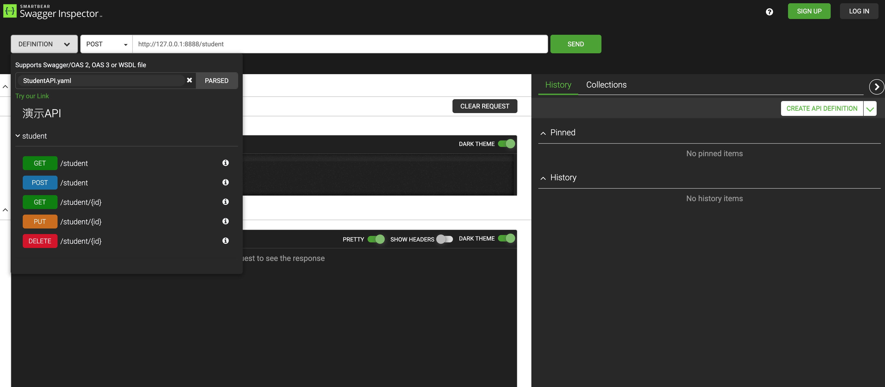

# Swagger概览
## Swagger是什么
引用官网原话：
Swagger是一个功能强大且易于使用的API开发人员工具套件，适用于团队和个人，支持从整个API生命周期（从**设计**和**文档**到**测试**和**部署**）的开发。
>Swagger is a powerful yet easy-to-use suite of API developer tools for teams and individuals, enabling development across the entire API lifecycle, from design and documentation, to test and deployment.

OpenAPI Specification(OAS)是OpenAPI的规范，该规范涉及30多个组织，包括微软、谷歌、IBM等。Swagger规范是其前身，同时Swagger工具集本身是OAS的实现。目前OAS是3.0版本，但使用最多的是2.0版本，因为相关的开源生态比较丰富，3.0还在发展中。

## API设计
Swagger通过yaml（也可以通过json，json与yaml可以互相转换）来定义API，可以通过[Swagger Editor](https://editor.swagger.io/)来编辑和实时预览定义的API。


在页面中，描述了API的URL、参数详情（类型、含义、是否必须、限制等）、返回值详情（HTTP状态码、描述、类型、示例），并提供了调用功能。


IDEA有对应的插件，使得编辑yaml和写代码一样，具有提示、补全和报错的功能。

设计出的yaml文件是整个API的核心产物，在不同的工具中均使用此文件，包括文档生成、代码生成、测试生成等，由于swagger是OAS的标准实现，所以有很多第三方工具支持，常用的包括swagger2markup、postman。

## API文档
通过定义好的yaml，可以很容易生成API文档，因为yaml是API的描述，如果对于现有工具集生成的文档感到不满意，可以自行定制，swagger2markup就是一个开源的将swagger的yaml转换为markdown的工具。

### HTML文档


在Swagger Editor的页面上，选择Generate Client -> html2 ，下载生成的zip包解压即可。

优点：
HTML文档是Swagger的原生支持，导出一个单文件的html，只要有浏览器即可，方便传输和浏览。

缺点：
相较于UI界面，只有主要的信息（不含返回示例），界面难看。

### Markdown

运行如下命令即可体验
```shell
docker run --rm -v $(pwd):/opt swagger2markup/swagger2markup convert -i /opt/StudentAPI.yaml -f /opt/swagger -c /opt/config.properties
```
优点：
信息全面，界面正式美观。

缺点：
第三方开源实现，支持Maven插件或Jar包运行，有官方Docker镜像，但相比HTML来说，需要java或docker环境支持。

---
在内部使用时，可以直接交换yaml文件，在Swagger Editor上来查看，无论是从信息全面性还是从美观性来讲，都是最好的。因为是在线服务，便利性也不差。

在对外使用时，建议生成Markdown，找一个好看的CSS，生成PDF，因为对外交付有指定对口人，所以只要特定的人有环境即可。

### API代码生成
Swagger可以生成多种语言的Server端代码与Client端代码，生成的Server端代码自带UI界面、参数校验等功能。


因本人技术栈原因，Server端使用Spring，Client使用Java。
### Server端
Swagger生成的Server可以直接运行，会自动返回yaml指定的example数据，对于前后端分离的开发模式，前端可以很容易调用这个Mock服务。

如果前端没有Java环境，Swagger生成的代码自带Dockerfile，可以很容易打成Docker镜像，或者将yaml给前端同学，其自行生产Node版本的Server，其输入输出与Java是一样的。

Swagger生成的Spring版本代码使用Spring Boot，设计的API将会自动生成接口，此示例中，接口为StudentApi。在开发时，直接写此API的实现类即可。

运行代码后，访问yaml中的host，可以看到UI界面，这里提供了文档和调用功能，可以很方便的测试程序。**此UI在目的在开发时减少沟通和测试成本，上生产请关闭**


在已有的项目中，可以使用Maven插件，只生成接口和实体类，已更好的和现有项目结合。（见示例spring-swagger-clean）

### Client端
生成的Client已经封装了整个HTTP调用的细节，可以向使用本地API一样完成服务调用。


**注意：在运行时，如果Server没有实现，默认返回的状态码是501，所以测试用例会报错，但responseBody已正常返回。**


## 测试
Postman支持导入swagger的yaml。


官方的Swagger Inspector是一个类似于Postman的工具，也支持导入swagger的yaml。


虽然官方提供了工具，不过个人习惯Postman。

## 小结
Swagger提供了整个API生命周期的工具集，包含设计、文档、开发、测试，除了官方产品外，还有很多第三方软件支持。
    
    SwaggerHub提供一站式能力，还带有监控、协同等功能。非开源
    
文档是基于描述的，只包含API信息，不包含样式信息，远比Word等带有样式的文档轻（程序员的文档，大多数是Markdown，一样的道理）。Swagger UI和swagger2markup提供了很好的样式。

Swagger的代码生成，除了可以减少代码开发以外，最终要的是能够**保证代码与文档的统一**，不会出现API的输入输出与文档不符（参数个数、类型等变化，编译会报错）的情况。

测试可以将yaml文件导入Postman，以便快速创建测试用例。

